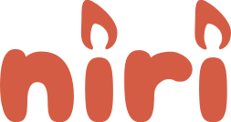

The name "niri" is canonically written in lower-case, but feel free to capitalize it if you'd like, especially at the start of sentences where the grammatical rules require it.
This name is not intended to mean or stand for anything.

Our logo comes in four versions: full-sized, simple full-sized, icon, and simple icon.
The simple versions are single-color and suitable for smaller sizes.

|        | full-sized                     | icon                           |
|--------|:------------------------------:|:------------------------------:|
| normal |       |       |
| simple |  |  |

The logo is intentionally recolorable.
In fact, there's [a webpage](https://nirilogo.raurutuchr.ink) that lets you quickly adjust the color and download an SVG.

All versions of the logo are licensed under [CC BY-SA](https://creativecommons.org/licenses/by-sa/4.0/).
The full-sized logo is based on the [Cherry Bomb One](https://github.com/satsuyako/CherryBomb) font, licensed under the [SIL Open Font License 1.1](https://openfontlicense.org/).
